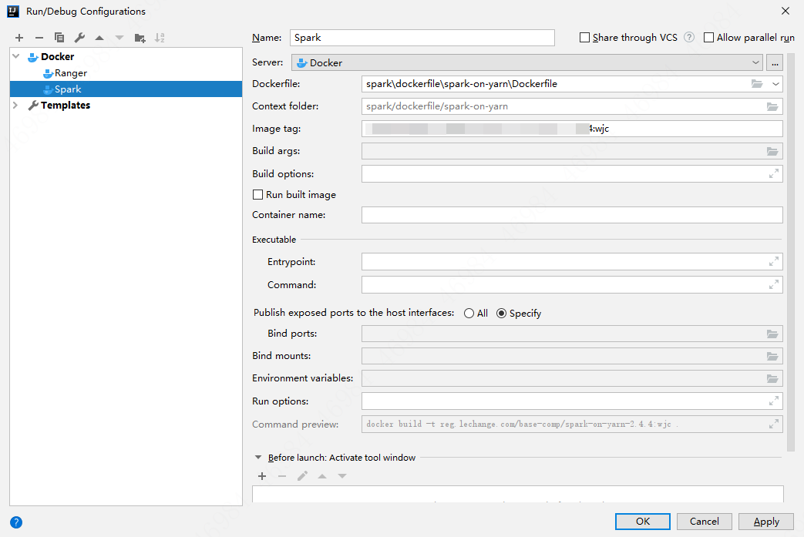

# 镜像
### 镜像列表
```shell
docker images
```
**--digests=true|false**：为true时，镜像列表多显示一列，如下：
|DIGEST|
|--|
|sha256:9183655bb75a7fdeaec96d5f84a56d4363c672d596f4ae25e01e957529d97f4e|

### tag

```shell
# 在centos-7.7.1908:20200424镜像上新增tag wjc-centos:latest
docker tag centos-7.7.1908:20200424 wjc-centos:latest
```

### 镜像详细信息

```shell
docker inspect wjc-centos:latest
```
得到的镜像详细信息是JSON格式的，如果想让信息精简一些可以使用`-f {{".RootFS.Layers"}}`，来获取详细信息中的某一个子条目。

### 查看创建历史
```shell
docker history wjc-centos
```
**--no-trunc**：查看完整信息

### 删除和清理镜像
```shell
# 根据镜像tag删除
docker rmi wc1:latest
# 根据镜像ID删除
docker rmi 6dbf8162bf50 -f
# 删除所有临时文件，加-a的话可以在删除临时文件的同时删除所有无用镜像
docker image prune
# 删除所有的本地镜像，慎用！！！
docker rmi $(docker images -q)
```
- 根据tag删除，只会删除对应tag，只有当镜像只剩下一个tag时，删除tag才会删除竟像文件；
- 根据ID删除镜像，直接会删除ID相同的所有tag和镜像文件
- 删除镜像必须先删除镜像对应容器（建议，可以加-f来强行删除）

### 创建镜像
- 基于已有容器创建
```shell
# 启动交互式容器
docker run -it 718aa89713c8 bash
# 修改镜像
ln -sf /usr/share/zoneinfo/Asia/Shanghai /etc/localtime
# 创建镜像 a：作者；m：提交说明
docker commit -m "tz update" -a "wjc" 26969b394f5c centos:0426
```
- 直接导入
```shell
# 保存镜像到本地
docker save -o centos.tar centos:0426
# 导入镜像
docker load -i centos.tar
# 保存容器到本地
docker export -o container.tar containerId 
# 导入镜像
docker import centos.tar centos:import
```
后面两种导入导出一般针对容器。前两种针对镜像，前两种方法能保存镜像的创建和更新历史信息。
- [Dockerfile创建](Dockerfile指南.md)

# 容器
### 创建容器
```shell
# -p 将容器的8080映射到主机10921 
docker create -it --name tomcat1 -p 10921:8080 reg.lechange.com/library/tomcat:8.0
# -P 随机映射端口
docker create --name tomcat2 -P  reg.lechange.com/library/tomcat:8.0
```
在create命令后面不跟-it的话会导致centos这样的镜像在启动容器后无法驻留。
### 删除容器
删除容器的两种方法：
先停止容器，再删除
直接删除容器，需要加-f
```shell
# 先停止容器，再删除
docker stop tomcat
docker rm tomcat
# 直接删除容器，需要加-f
docker rm -f tomcat tomcat1 tomcat2
# 删除主机上所有的容器，慎用！！！
docker rm -f $(docker ps -aq)
```
### 启动容器
```shell
# 启动容器
docker start tomcat
# 守护态运行容器，先创建、再启动
docker run -d -p 10920:8080 --name tomcat reg.lechange.com/library/tomcat:8.0
# 重启
docker restart tomcat
```
### 停止容器
```shell
# 停止
docker stop tomcat
# 停止主机上所有的容器，慎用！！！
docker stop $(docker ps -aq)
```
### 进入容器
```shell
docker exec -it tomcat bash
# 进入容器后
# 容器内的进程信息，包含通过bash进入容器的用户数量，每个bash都有对应的进程
ps -ef
```
### 暂停容器
暂停和关闭的区别：暂停将容器内部和外部的交互全部暂停，比如，将tomcat容器暂停时，浏览器不会立马返回错误，请求阻塞在pending状态，如果容器停止会立马返回借口请求异常。
```shell
# 暂停
docker pause tomcat
# 取消暂停
docker unpause tomcat
```
### 容器监控
#### 查看日志
```shell
# 查看详细日志
docker logs tomcat
# 保持持续输出日志
docker logs -f tomcat
# 查看指定时间段的日志
docker logs --since 2020-04-16T11:28:00 --until 2020-04-16T11:28:59 45c5c192a01c > /tmp/tmp
```
#### 查看容器详情
```shell
# 可以是镜像ID、镜像TAG、容器ID和容器名称
docker inspect trusting_hodgkin
```
#### 查看容器内进程
```shell
# 查看单个容器的进程
docker top tomcat
```
#### 查看容器资源使用情况
```shell
# 查看tomcat的容器的资源使用情况
docker stats tomcat
# 查看所有容器的资源使用情况
docker stats -a
```
- **--no-stream**：不刷新，默认会持续刷新实时结果
- **--no-trunc**：不截断输出信息
### 容器和主机之间文件传输
```shell
# 将容器内/usr/local/tomcat/RUNNING.txt拷贝到当前目录
docker cp tomcat:/usr/local/tomcat/RUNNING.txt .
```
### 查看容器变更记录
```shell
docker diff tomcat
# output: 
# A /1.pcap
# C /tmp
# C /tmp/hsperfdata_root
# A /tmp/hsperfdata_root/1
# C /root
# A /root/.bash_history
```
### 查看容器端口映射
```shell
docker port tomcat
```
### 更新容器配置
更新cpu、mem、IO等资源的使用限制配置
```shell
docker update
```
# 仓库
`private-docker.com/ubuntu`对于这个地址来说，`private-docker.com`是注册服务器，`ubuntu`是仓库，也就是说，注册服务器是具体存放镜像仓库的服务器，仓库可以是目录，也可以是项目，比如`ubuntu`就是项目。
# 数据卷
数据卷的特性：
- 多容器之间、容器和主机之间共享数据，方便快捷
- 修改对所有容器和主机实时生效
- 解耦数据和应用
- 只有在没有容器使用时，才能删除
```shell
# 将主机/home/wjc/webapp映射到/opt/
docker run --name vt --mount type=bind,source=/home/wjc/webapp,destination=/opt/webapp -it -d centos:0426 bash
# 将主机/home/wjc/webapp映射到/opt/webapp
docker run --name vt1 -v /home/wjc/webapp:/opt/webapp -itd centos:0426 bash
```
在使用mount时，source对应的目录在主机上必须存在，使用v时会自动创建本地目录。相比较而言，mount的方法指定数据卷会更容易看懂，但信息冗余较多，两者并无本质区别。

# IDEA Docker插件使用

## Docker开启远程连接端口

在`/lib/systemd/system/docker.service`文件中找到`ExecStart=/usr/bin/dockerd`开头的行，在尾部追加`-H tcp://0.0.0.0:2375`，再执行如下命令行，重启docker服务
```shell script
systemctl daemon-reload
systemctl restart docker.service
```
经过以上操作就可以在IDEA中配置TCP方式连接Docker了。

## Dokcer image

配置方法如下图：


# TODO
- 容器配置怎么更新？更新后有啥效果？


