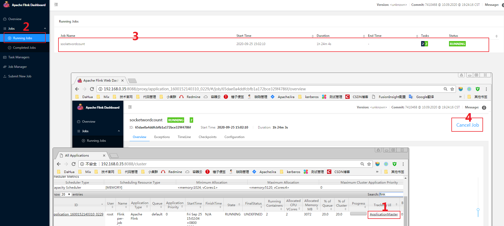
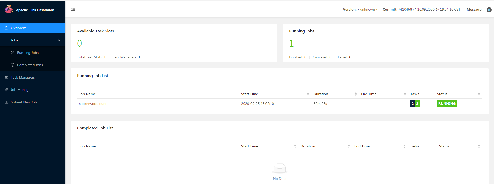
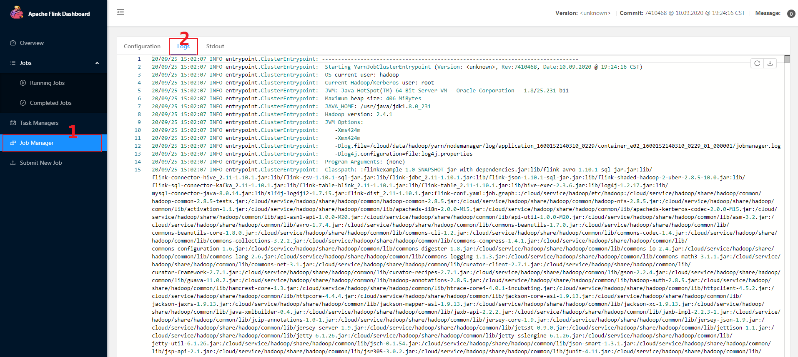
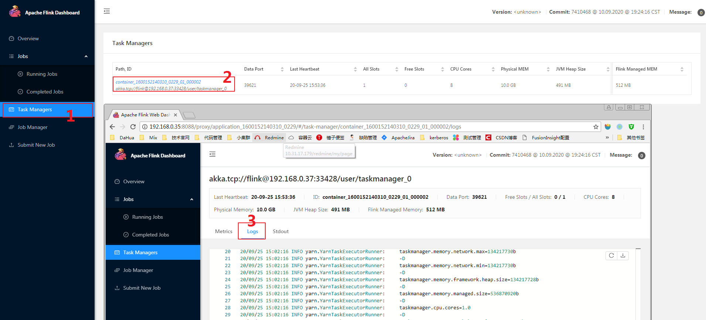
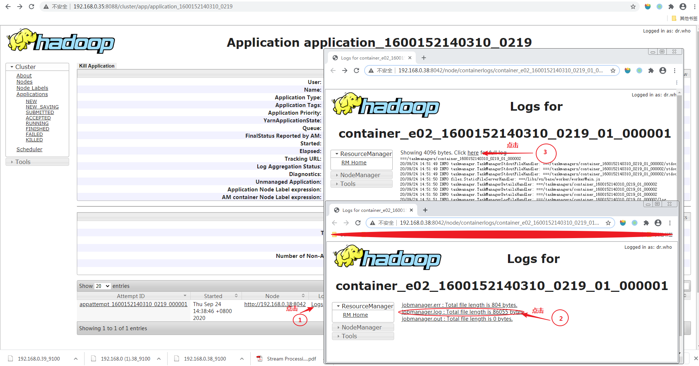
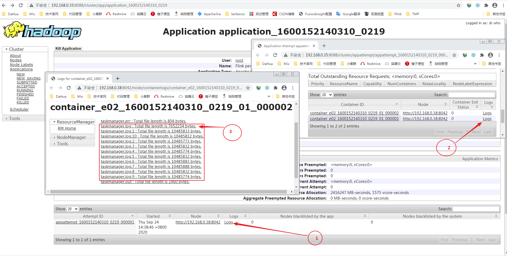
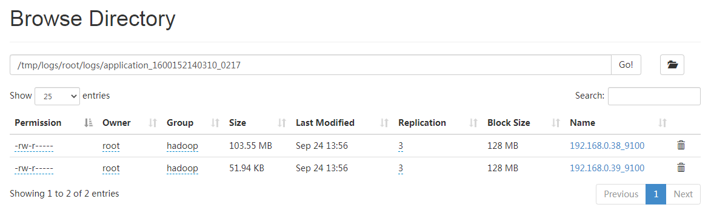

# 前言：注意事项

建议：如果我们想停止Flink任务，请通过Flink WEB UI取消任务，不要在Yarn上直接Kill任务，两者的区别是，前者在任务停止后能在Flink History上看到任务信息，后者在Flink History没有任何信息。



# Flink On Yarn任务日志配置详解

## 1 配置参考模板（log4j.properties）

```
# This affects logging for both user code and Flink
log4j.rootLogger=INFO, RollingFile

# Uncomment this if you want to _only_ change Flink's logging
#log4j.logger.org.apache.flink=INFO

# The following lines keep the log level of common libraries/connectors on
# log level INFO. The root logger does not override this. You have to manually
# change the log levels here.
log4j.logger.akka=INFO
log4j.logger.org.apache.kafka=INFO
log4j.logger.org.apache.hadoop=INFO
log4j.logger.org.apache.zookeeper=INFO

log4j.appender.RollingFile=org.apache.log4j.RollingFileAppender
log4j.appender.RollingFile.File= ${log.file}
log4j.appender.RollingFile.MaxFileSize=10MB
log4j.appender.RollingFile.MaxBackupIndex=10
log4j.appender.RollingFile.layout=org.apache.log4j.PatternLayout
log4j.appender.RollingFile.layout.ConversionPattern=%d{yy/MM/dd HH:mm:ss} %p %c{2}: %m%n

# Suppress the irrelevant (wrong) warnings from the Netty channel handler
log4j.logger.org.apache.flink.shaded.akka.org.jboss.netty.channel.DefaultChannelPipeline=ERROR, RollingFile
``` 
|
**参数说明：**  
 
- 配置项“MaxFileSize”控制输出日志的大小，如果超过配置的值，会产生滚动。
- 配置项“MaxBackupIndex”控制滚动日志保留的文件数。


## 2 配置后的效果

### 2.1 查看正在运行任务的日志

- 方法一：进入Flink WEB UI查看任务日志

**进入Flink WEB UI**，点击ApplicationMaster，如下图所示：



**JobManager日志如下:**（只能查看jobmanager.log中的日志，jobmanager.log.1~MaxBackupIndex的日志如法查看）



**TaskManager日志如下:**（只能查看taskmanager.log中的日志，taskmanager.log.1~MaxBackupIndex的日志如法查看）




- 方法二：在Yarn管理页面上查看任务日志

**JobManager日志如下:**（其中jobmanager.log为JobManager进程的日志输出文件）



**TaskManager日志如下:**（其中taskmanager.log为TaskManager进程的日志输出文件）



- 方法三：直接访问NodeManager节点上的临时目录

**JobManager日志如下:**（其中jobmanager.log为JobManager进程的日志输出文件）

```sh
[root@hadoop-datanode-nodemanager-1 container_e02_1600152140310_0219_01_000002]# ll /cloud/data/hadoop/yarn/nodemanager/log/application_1600152140310_0219/container_e02_1600152140310_0219_01_000001/
total 92
-rw-r--r-- 1 hadoop hadoop   804 Sep 24 14:38 jobmanager.err
-rw-r--r-- 1 hadoop hadoop 86055 Sep 24 14:51 jobmanager.log
-rw-r--r-- 1 hadoop hadoop     0 Sep 24 14:38 jobmanager.out
```

**TaskManager日志如下:**（其中taskmanager.log为TaskManager进程的日志输出文件）
```sh
[root@hadoop-datanode-nodemanager-1 container_e02_1600152140310_0219_01_000002]# pwd
/cloud/data/hadoop/yarn/nodemanager/log/application_1600152140310_0219/container_e02_1600152140310_0219_01_000002
[root@hadoop-datanode-nodemanager-1 container_e02_1600152140310_0219_01_000002]# ll
total 109924
-rw-r--r-- 1 hadoop hadoop      804 Sep 24 14:38 taskmanager.err
-rw-r--r-- 1 hadoop hadoop  7652234 Sep 24 14:53 taskmanager.log
-rw-r--r-- 1 hadoop hadoop 10485833 Sep 24 14:53 taskmanager.log.1
-rw-r--r-- 1 hadoop hadoop 10485832 Sep 24 14:53 taskmanager.log.10
-rw-r--r-- 1 hadoop hadoop 10485773 Sep 24 14:53 taskmanager.log.2
-rw-r--r-- 1 hadoop hadoop 10485832 Sep 24 14:53 taskmanager.log.3
-rw-r--r-- 1 hadoop hadoop 10485774 Sep 24 14:53 taskmanager.log.4
-rw-r--r-- 1 hadoop hadoop 10485832 Sep 24 14:53 taskmanager.log.5
-rw-r--r-- 1 hadoop hadoop 10485883 Sep 24 14:53 taskmanager.log.6
-rw-r--r-- 1 hadoop hadoop 10485888 Sep 24 14:53 taskmanager.log.7
-rw-r--r-- 1 hadoop hadoop 10485832 Sep 24 14:53 taskmanager.log.8
-rw-r--r-- 1 hadoop hadoop 10485774 Sep 24 14:53 taskmanager.log.9
-rw-r--r-- 1 hadoop hadoop     1460 Sep 24 14:53 taskmanager.out
```

### 2.2 查看已结束任务的日志

JobManager和TaskManger的日志均存放在hdfs上，路径格式为 `/tmp/logs/root/logs/<application id>/` ，根据子任务运行节点查看对应日志，点击下载即可，也可后台使用hdfs命令行的方式下载日志。



> 如果上图hdfs目录未显示JobManger的日志，可以在Yarn管理页面上查看，方法参考 `任务运行时查看日志` 部分的JobManager日志的查看方法。


