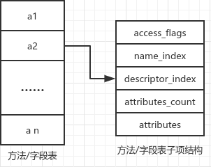

# Class文件中数据类型

- 无符号数：用`u+数字`表示，例如：u2表示2个字节的无符号数
- 表：由无符号数和其他数据项组成，其中无符号数代表表的长度

# Class文件的内容

类型 | 名称 | 数量 |
:-: | :-: | :-: |
 u4 | magic | 1 |
 u2 | minor_version | 1 |
 u2 | major_version | 1 |
 u2 | constant_pool_count | 1 |
 cp_info | constant_pool | constant_pool_count - 1 |
 u2 | access_flags | 1 |
 u2 | this_class | 1 |
 u2 | super_class | 1 |
 u2 | interfaces_count | 1 |
 u2 | interfaces | interfaces_count |
 u2 | fields_count | 1 |
 field_info | fields | fields_count |  |
 u2 | methods_count | 1 |
 method_info | methods | methods_count |
 u2 | attributes_count | 1|

> 上表数据在Class文件中按表中顺序出现。

# 方法/字段表结构



上图，name_index指向常量池中的方法/字段名的字符串常量，descriptor_index指向常量池中方法/字段描述的字符串常量。

```java
public class ClassStructure {
    private int[] a = new int[10];
    public static void func(int a1, int[] a2, String a3){}
}
```

上述代码，字段a的name_index对应字符串为`a`，descriptor_index对应字符串为`[I`，方法func的name_index对应的字符串为`func`，descriptor_index对应字符串为`(I[ILjava/lang/String;)V`
