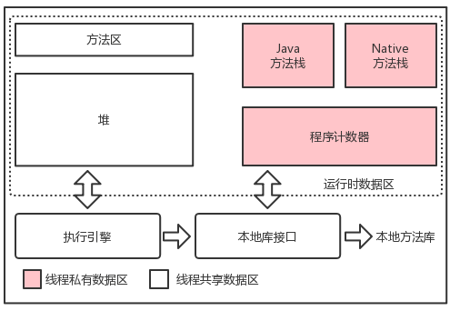
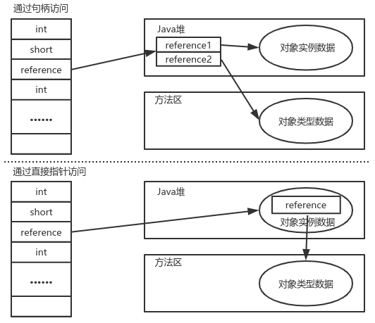

# JVM运行时数据区

- 程序计数器不会发生OutOfMemoryError
- Java方法栈和Native方法栈会抛出StackOverflowError和OutOfMemoryError
- 方法区和堆中只会抛出OutOfMemoryError
> 在设置JVM内存参数的时候一定要格外注意`运行时内存+直接内存<物理内存 `，否则，JVM内存动态扩展的时候会抛OutOfMemoryError

# 对象内存布局

- 对象头
  - Mark Word：HashCode、GC分代年龄、锁状态标志位、线程持有的锁、偏向线程ID、偏向时间戳等
  - 类型引用指针（非必须）
- 对象实例数据
- 空白填充（非必须）：当对象大小不是8的整数倍时存在

# 对象访问定位

