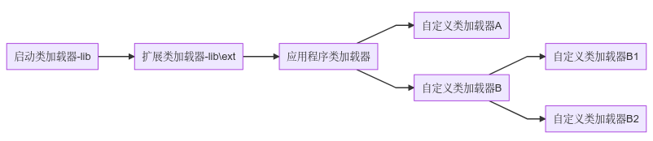

# 类加载器的解释

每个类加载器都有一个独立的命名空间，不同类加载器加载的同一个类也是不相同的，调用equals、instanceof等方法结果都是false。

# 类加载器继承关系图

# 双亲委派模型

如果一个类加载器收到了类加载的请求，该类加载器首先会请求父类加载器来加载类，如此层层请求，最终类加载请求都会传到启动类加载器中，只有当父类无法完成类加载时，才会交给子类加载器加载。

这样做的好处是，能保证同一个类总能被一个类加载器加载。比如：java.lang.Object类是所有类的父类，无论加载哪个类都会先加载该类，有了双亲委派模型之后，所有类加载请求最终都会传递到启动类加载器中，所以Object类总能被启动类加载器加载。如果不这样做，每个类加载器分别加载Object，整个系统会出现多个不同的Object类。

> 类加载器的使用典范：Tomcat、OSGi、JNDI