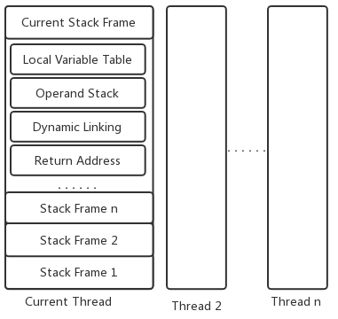

### JVM运行时栈帧结构图



### 局部变量表

局部变量表以变量槽（Slot）为最小单位，通常Slot的大小为32位。Java中占用32位以内的数据类型占用一个Slot，如：boolean、byte、char、short、into、float、reference和returnAddress，占用64位的数据类型会占用两个Slot，如：long和double。

存方法参数和方法内局部变量，字节码文件中，方法中Code属性的max_locals标记了局部变量表的最大容量。局部变量表的最大容量并不是简单的将所有局部变量占用字节大小相加，而是会结合变量的作用域有复用的计算一个最大值。

```java
//code 1
public static void fun() {
    {
        int[] aa = new int[1];
    }
    int bb = 1;
    //System.gc();
}
```

上述函数的局部变量表的大小为1，是因为在运行到int aa = 1时，bb还没有声明，当代码运行到int bb = 1时，aa已经不在作用域了，所以整个方法执行时最多同时存在一个变量。可以对比看下下面这段代码，局部变量表的大小为2。

```java
//code 2
public static void fun() {
    int bb = 1;
    {
        int[] aa = new int[1];
    }
    //System.gc();
}
```

如果将code1和code2中System.gc()的注释去掉，code1中aa指向的对象会被回收，而code2中aa指向的对象不会被回收，原因是在主动触发GC时，code1中的aa变量在变量表中已经被bb所覆盖，而code2中的aa仍然存在于栈帧的变量表中，只有当栈帧退出调用栈时，aa才会被回收。

### 操作数栈

操作数栈是一个先入后出栈，32位以内的数据类型占用栈容量为1,64位数据类型占用栈容量为2。字节码指令在执行时会在操作数栈上做入栈和出栈的操作。例如：iadd指令在做加法时，会从操作数栈的栈顶取出两个int型的数值，在做完加法后会将结果入栈。

### 动态连接

方法调用指令是以常量池中指向方法的符号引用为参数，这些符号引用一部分会在类加载或第一次使用时转化为直接引用，而还有一部分需要每次运行期间转化为直接引用，这部分称为动态连接。

### 方法返回地址

正常退出时，根据上一个栈帧的PC来决定代码的执行位置；异常退出时，根据异常处理器来决定代码的执行位置，异常表在方法区，不在栈帧中。