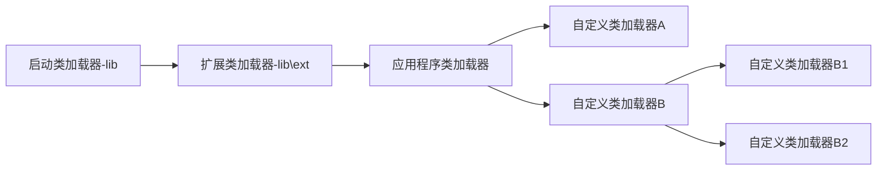

# 初始化的时机

- new对象、调用类的静态方法、使用静态字段（final修饰的常量除外）
- 反射调用
- 初始化一个类时，父类未初始化，则触发父类初始化
- 虚拟机启动时，主类初始化
- java.lang.invoke.MethodHandle解析结果的方法句柄触发对应的类初始化

> 虚拟机的类初始化只有以上5中情况。
>
> 不会触发类初始化的情况：
>
> 1. 在通过子类调用父类的静态字段，只初始化父类，不会初始化子类
> 2. 通过数组定义类的引用，会触发*L+类名*的数组类初始化，不会触发类的初始化
> 3. 调用类常量，由于类常量在编译期已经加载入常量池，故不会导致初始化
>
> 以上三种情况其实还是会导致类加载，只是不初始化。

# 类加载过程

###  1 加载

通过类的全限定名获取class文件的字节流，可以从任何类型的文件或网络中获取class类的字节流。

### 2 校验

字节流的格式、字节码的语义、类的继承关系、变量声明是否合法，主要时确保字节码是安全、未被修改、且可以使用。

### 3 准备

解析出类的结构放于方法区（到底放不放方法区有待验证？），并给类结构分配内存，包括类变量、类常量、类方法、实例方法，给类变量分配内存并赋默认值，类常量会被初始化，而实例变量在初始化时再分配内存，例如：

```java
static int a=2；
static final int b = 3;
```

在准备阶段a的值为0，b的值为3


# 类加载器继承关系图



# 双亲委派模型

如果一个类加载器收到了类加载的请求，该类加载器首先会请求父类加载器来加载类，如此层层请求，最终类加载请求都会传到启动类加载器中，只有当父类无法完成类加载时，才会交给子类加载器加载。

这样做的好处是，能保证同一个类总能被一个类加载器加载。比如：java.lang.Object类是所有类的父类，无论加载哪个类都会先加载该类，有了双亲委派模型之后，所有类加载请求最终都会传递到启动类加载器中，所以Object类总能被启动类加载器加载。如果不这样做，每个类加载器分别加载Object，整个系统会出现多个不同的Object类。

