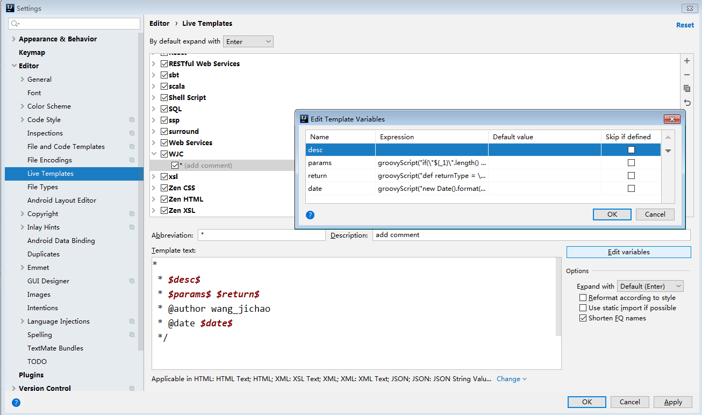

# 快捷键

- `Shift+Enter`：在当前行后新开一行

# 添加系统JDK

Project Structure->Project SDK->new

# 添加注释

Settings -> Editor -> Live Templates  
- 右侧`+`号，Template Group（Group Name随便填写，如：WJC）
- 选中上一步的Group，右侧`+`号，Live Template

```
Template text: 
*
 * $desc$
 * $params$ $return$
 * @author wang_jichao
 * @date $date$
 */

params: 
groovyScript("if(\"${_1}\".length() == 2) {return '';} else {def result=''; def params=\"${_1}\".replaceAll('[\\\\[|\\\\]|\\\\s]', '').split(',').toList();for(i = 0; i < params.size(); i++) {if(i<(params.size()-1)){result+=' * @param ' + params[i] + ' ' + '\\n'}else{result+=' * @param ' + params[i] + ' '}}; if(result==' * @param null ') {return '';} else {return '\\n'+result;}}", methodParameters());

return: 
groovyScript("def returnType = \"${_1}\"; def result = ' * @return ' + returnType;if(returnType==null||returnType=='null'||returnType=='void') {return '';} else {return '\\n'+result;}", methodReturnType());

date: 
groovyScript("new Date().format('yyyy年MM月dd日 ahh:mm:ss')")
```